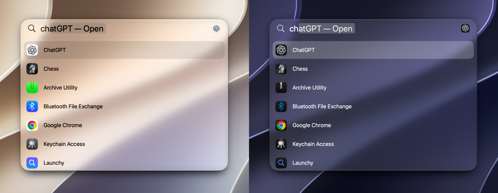

# Launchy

A Spotlight-style app launcher for macOS, built with SwiftUI and Liquid Glass.

## Installation

Download `launchy.zip` from the [Releases](https://github.com/Jackevansevo/launchy/releases) page, unzip it, and move `launchy.app` to your Applications folder.

Launchy requires **macOS 27 Golden Gate** or later.

Launchy isn't notarized by Apple, so macOS will block it the first time you open it. Try to open the app once, then go to **System Settings → Privacy & Security**, scroll down, and click **Open Anyway** next to the message about Launchy.

You only need to do this once.

## Usage

- Press **⌥ Space** (or **⌘ Space**, from the menu bar icon's Shortcut menu) to show the launcher.
- Type to search your apps, use the arrow keys to pick one, and press **Return** to open it.
- Press **Esc** or click outside the launcher to hide it.

Launchy can also start at login: turn on **Launch at Login** from the menu bar icon.
